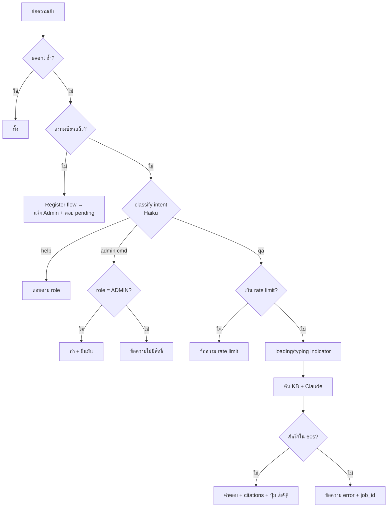

# Javis Chat Message Catalog (PLAN-002 T1.6)

> Single source of truth ของ **ทุกข้อความที่ bot ส่ง** — n8n อ่าน copy จากไฟล์นี้ ห้าม hardcode ใน Code node
> Tone: สุภาพ เป็นกันเอง ลงท้าย "ครับ", สั้น กระชับ, ศัพท์เทคนิคคง English, emoji ประกอบ 1 ตัว/ข้อความไม่เกิน
> Placeholder: `{name}`, `{job_id}`, `{minutes}`, `{admin_name}` ฯลฯ — n8n เติมตอนส่ง
> สถานะ: draft — ต้องผ่าน review 1 รอบก่อนเริ่ม build สัปดาห์ 2 (AC ของ T1.6)

## 1. Welcome / Register (intent: `register`)

| State | ข้อความ |
|---|---|
| follow / /start ครั้งแรก (ยังไม่ลงทะเบียน) | สวัสดีครับ ผม Javis 🤖 ผู้ช่วยคลังความรู้ของทีม\nตอนนี้คุณยังไม่ได้ลงทะเบียน — ผมส่งคำขอถึง {admin_name} ให้แล้ว รออนุมัติสักครู่ครับ |
| register pending (ทักซ้ำระหว่างรอ) | คำขอของคุณกำลังรอ {admin_name} อนุมัติครับ 🙏 เดี๋ยวผมแจ้งทันทีที่ใช้งานได้ |
| register approved | ลงทะเบียนสำเร็จ ยินดีต้อนรับคุณ {name} 🎉 พิมพ์ "help" เพื่อดูว่าผมช่วยอะไรได้บ้างครับ |
| register rejected | ขออภัยครับ คำขอไม่ได้รับอนุมัติ — สอบถามเพิ่มเติมได้ที่ {admin_name} |
| ข้อความถึง Admin (พร้อมปุ่ม) | 📥 คำขอลงทะเบียนใหม่: {display_name} ({channel})\n[อนุมัติ VIEWER] [อนุมัติ CONTRIBUTOR] [ปฏิเสธ] |

## 2. Help (intent: `help`)

ตอบตาม role ของผู้ถาม — แสดงเฉพาะสิ่งที่ role นั้นทำได้:

```
ผมช่วยอะไรได้บ้าง 💡
• ถามความรู้ทีม: พิมพ์คำถามได้เลย เช่น "ขั้นตอน deploy ทำยังไง"
{ถ้า CONTRIBUTOR+} • เก็บเนื้อหาเข้า KB: "Javis เก็บ meeting note นี้หน่อย" (Phase 2)
{ถ้า ADMIN} • คำสั่งดูแลระบบ: javis config set <key> <value>, javis role set <email> <role>
ตอบจากคลังความรู้ของทีมเท่านั้น — ไม่รู้ผมจะบอกตรงๆ ครับ
```

## 3. Q&A (intent: `qa`)

| State | ข้อความ |
|---|---|
| Ack (LINE = loading animation, Telegram = typing) | *(ไม่มีข้อความ — ใช้ indicator ของ platform)* |
| ตอบสำเร็จ | {answer}\n\n📎 อ้างอิง: {citations} |
| ไม่พบใน KB | ไม่พบข้อมูลนี้ใน KB ครับ 🙏 ลองถามคุณ {owner} ที่ดูแลเรื่องนี้ หรือถ้ามีเอกสาร ส่งเข้า KB ได้เลยครับ |
| คำถามกำกวม | ขอถามเพิ่มนิดครับ: {clarifying_question} |
| ข้อมูลขัดแย้งกัน | เจอข้อมูล 2 ทางครับ ⚠️\n• {source_a}: {claim_a}\n• {source_b}: {claim_b}\nแนะนำเช็คกับ owners: {owners} |
| Timeout / error | ขออภัยครับ ระบบขัดข้องชั่วคราว 🙏 ลองใหม่อีกครั้งได้เลย (รหัสอ้างอิง: {job_id}) |
| Rate limit | วันนี้คุณถามครบโควต้าชั่วโมงนี้แล้วครับ ถามได้อีกครั้งตอน {next_window} (โควต้า: {limit} คำถาม/ชม.) |
| Session ใหม่ (หมด TTL) | (เริ่มบทสนทนาใหม่) {answer}... |
| คำตอบยาวเกิน limit | {summary}\n\n📄 ฉบับเต็ม: {link} |
| ไฟล์/sticker/รูป ที่ยังไม่รองรับ | ตอนนี้ผมรับเฉพาะข้อความครับ 🙏 (รับไฟล์เอกสารได้ใน Phase 2) |
| พบ prompt injection ในเอกสาร | ⚠️ พบข้อความในเอกสาร {doc} ที่พยายามสั่งงานผม — ผมไม่ทำตามและแจ้งทีมแล้วครับ |

## 4. Feedback (ปุ่มท้ายคำตอบ Q&A)

| State | ข้อความ |
|---|---|
| ปุ่ม | [👍 ตอบตรง] [👎 ยังไม่ใช่] |
| กด 👍 | ขอบคุณครับ 🙏 |
| กด 👎 | รับทราบครับ ทีมจะปรับปรุง — ถ้าสะดวก พิมพ์บอกได้ว่าคำตอบควรเป็นยังไงครับ |
| กดซ้ำ | บันทึกความเห็นล่าสุดของคุณแล้วครับ |

## 5. Permission / Admin

| State | ข้อความ |
|---|---|
| ไม่มีสิทธิ์ทำ action | สิทธิ์ของคุณ ({role}) ยังทำรายการนี้ไม่ได้ครับ — ขอสิทธิ์เพิ่มได้ที่ {admin_name} |
| Admin เปลี่ยน config สำเร็จ | ✅ ตั้งค่า {key} = {value} มีผลทันที |
| Admin เปลี่ยน role สำเร็จ | ✅ {email} เป็น {role} แล้ว |
| ปุ่มเก่า / กดซ้ำ (ทุก intent) | รายการนี้ดำเนินการแล้วโดย {actor} เมื่อ {time} ครับ |

## 6. Flow ต่อ intent (Phase 1)



## กติกาการแก้ไฟล์นี้

1. แก้/เพิ่มข้อความ → commit ปกติ (ไฟล์นี้ไม่ต้องมี frontmatter — อยู่นอก SCAN_DIRS)
2. เพิ่ม intent ใหม่ (Phase 2+: upload, impact, plan, gendoc) → เพิ่ม section ใหม่ + flow diagram
3. ทุกข้อความใหม่ยึด tone ด้านบน — review โดยคนก่อนเปิดใช้
